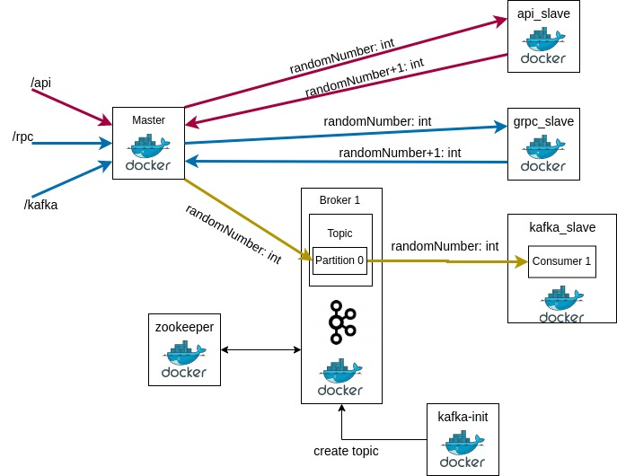

# Synthetic microservice interaction

## Used interation types:
* API call via http
* gRPC call
* send message via Kafka (1 broker)

## Architecture

## Deploying
* `make run`:
    * build golang executables
    * start with healthcheck zookeeper & kafka
    * init kafka topic (by extra kafka-init container)
    * start microservices with voluming executable file after kafka topic initing
* `make stop`: stop all containers

## Usage (testing)
if answer `{'ok': true}` - OK.

For checking result see logs of master and slave. API and RPC slaves return generated by master randomNumber + 1. Kafka slave only receive randomNumber from master service.

`curl -X POST localhost:3000`
* `/api` -- http interaction
* `/rpc` -- gRPC interaction
* `/kafka` -- Kafka interaction
